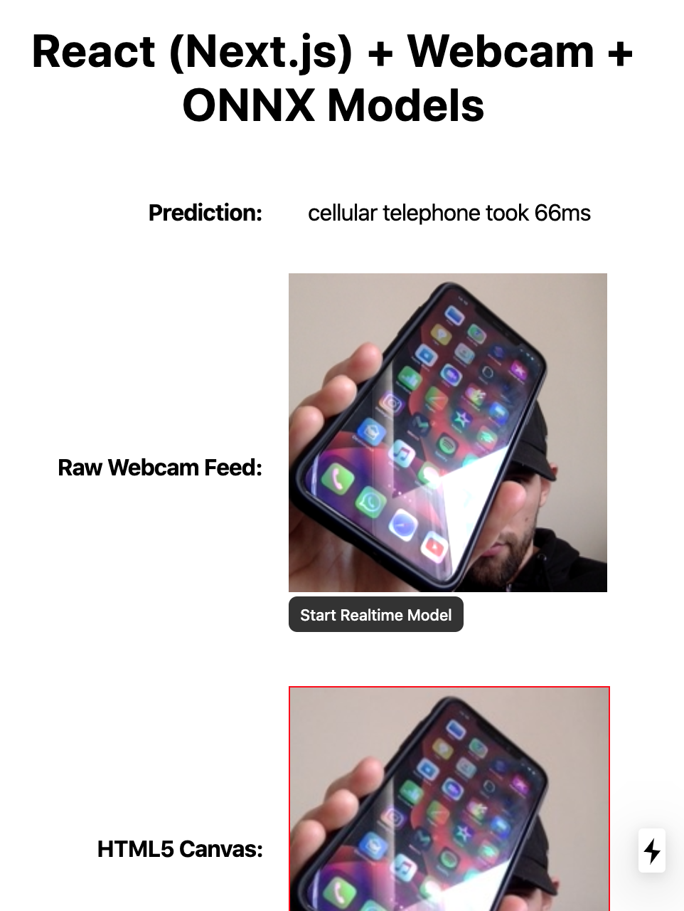

# React (Next.js) + Webcam + ONNX Models 

I'm currently (as of April 2020) studying [Practical Deep Learning for Coders, v3](https://course.fast.ai/) and I wanted to build an actual app that works.

It's quite simple to export a FastAI (PyTorch) model to the ONNX format.

This is using code from [ONNX Heatbeat](https://github.com/zsajjad/onnx-heartbeat) project by [@zsajjad](https://github.com/zsajjad).

I wanted to run a model in realtime with a direct camera feed. Think the cameras on a car.

This worked surpisingly well.

It uses just webcam, drops the image data onto an HTML5 Canvas, then reads the image data off and off loads to the ONNX model.

This is using the standard SqueezeNet model. I tried with other models but couldn't get the image preprocessing to work.

Cool thing is this uses webgl, wasm or CPU depending on platform. As you can see from the perform the inference time is really fast, sub 100ms.